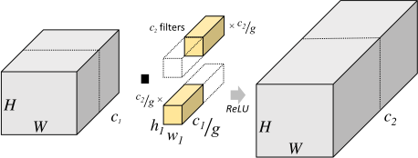

# About
3D grouped convolutions in PyTorch are slow. This repo provides a way to tune faster grouped 3d convolution modules that can be used in exactly the same way as a standard pytorch module.  

# Motivation
Grouped convolutions for most cases should be faster than group-1 convolutions since there is less parameters and less operations. In pytorch 2D grouped convolutions are faster than their group-1 counterparts but for 3D convolutions this is not the case. 

The image ([source: Yani Ioannou](https://blog.yani.io/filter-group-tutorial/)) diagrams a 2D convolution with two groups.


The table demonstrates slow 3D grouped convolutions for 1000 forward-backward convolution iterations of image sized 50x50(x50 for 3D) with kernel size 3 and 64 input and output channels.

|    Groups     | 2D            | 3D            |
| :-----------: | :-----------: | :-----------: |
|      1        | 1.68339s      | 126.51723s    |
|      64       | 1.49539s      | 509.46911s    |

We can see that the grouped 2D convolution is slightly quicker than the group-1 version, but in 3D the grouped convolution is many times slower than the group-1 version.

# Tensor Comprehensions (TC)
[Tensor comprehensions](https://github.com/facebookresearch/TensorComprehensions) is a FacebookResearch library that "automatically synthesize[s] high-performance machine learning kernels".
TC is integrated with pytorch so we can use it to create fast GPU kernels for pytorch modules - although most modules implemented by PyTorch will be faster than any automatically generated versions. 

# Installation
- [Build or install TC library](https://github.com/facebookresearch/TensorComprehensions/blob/master/docs/source/installation.rst) first. 
    - This [dockerfile](Dockerfile), a slightly modified version of TC build dockerfile, is what I used to build the TC library for PyTorch 0.4.0.
- Clone this repo `git clone https://github.com/MattPainter01/Grouped3DConvPyTorch`
- Link to python by: 
    - Adding to your python path through suitable `export PYTHONPATH=...` command or
    - [adding a path configuration file (.pth) in site-packages](https://docs.python.org/3/library/site.html) or
    - `pip install git+https://github.com/MattPainter01/Grouped3DConvPyTorch.git`

# Usage
Usage simple: 
```python
from Group3DConvTC.tc_conv import Grouped3D
g3d = Grouped3D(...)
output = g3d(data)
```

If the `from_cache` flag is False then the TC will be tuned using default settings or those provided under the `tuner_config` keyword. If `from_cache` is True then a pre-tuned operation will be loaded from the file provided with the `cache_file` keyword.  

# Pretuned Operations
Unfortunatly tuned tensor comprehensions are machine specific and cannot be ported to other machines (as far as I know). In the same way they are also strongly parameter specific, so you will need to tune new TCs for different kernel sizes, input/output channels, groups, etc. 

WARNING: Tuning this TC is very slow, takes a couple hours to train well on my machine.  

# Timings

The table shows the timings from [tc_timings.py](Profiling/tc_timings.py) for 100 forward-backward iterations of a 50x50x50 image, 64 input and output channels with 64 groups and kernel size 3.

|    Method     | Time          |
| ------------: | :-----------: |
|      PyTorch  | 42.01592s     |
|      TC       | 12.33247s     |

